# Toronto Asian Art Museum Artifact Database App

## Overview

This project was developed as the final project for the Software Design course at the University of Toronto. The goal was to create an Android app for the Toronto Asian Art Museum to manage their artifact database. The app is built using **Java** and **Firebase**, providing a comprehensive solution for managing artifacts with a user-friendly interface.

### Features:

-   **User Authentication:** Login and sign-up powered by **Firebase** for secure access.
-   **Artifact Management:** Add, view, and delete artifacts within the database.
-   **Search Functionality:** Easily search for specific artifacts.
-   **PDF Report Generation:** Generate PDF reports for artifacts in the database.
-   **Theming:** Switch between light and dark themes for better user experience.

## Screenshots

### Login Screen

<div align="center">
  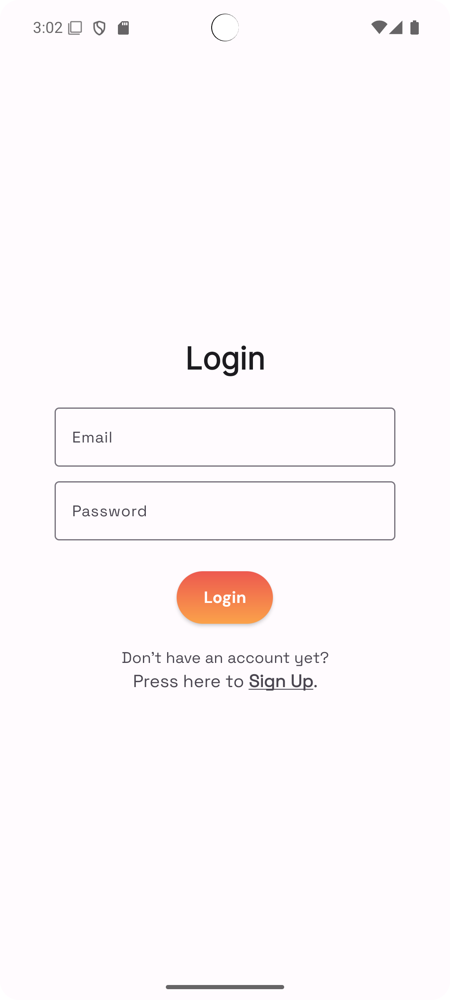 
  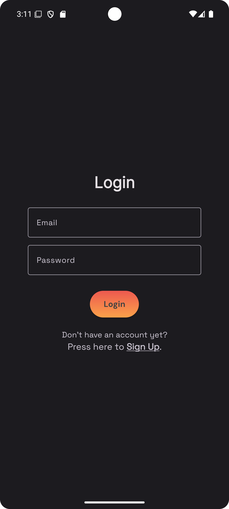
</div>

### Register Screen

<div align="center">
  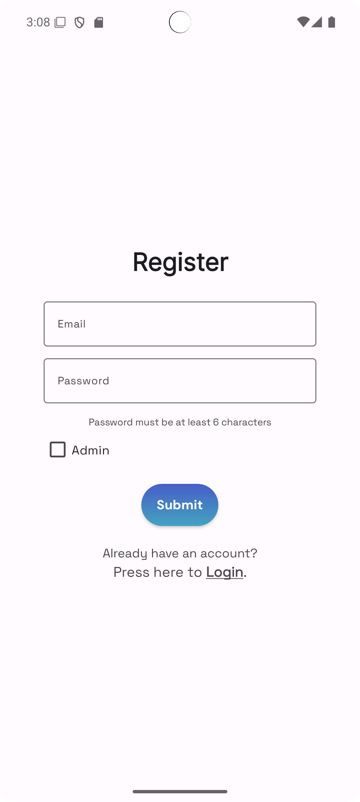 
  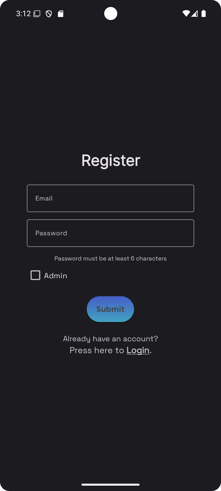
</div>

### Homepage

<div align="center">
  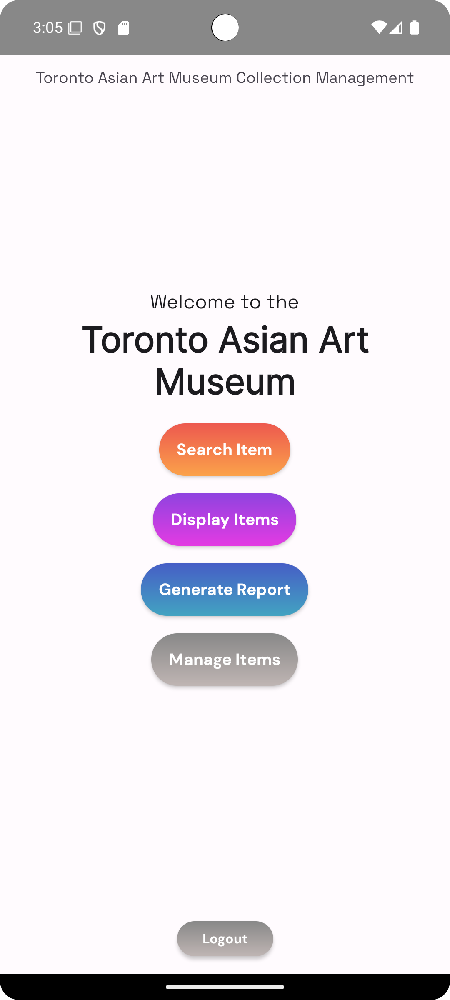 
  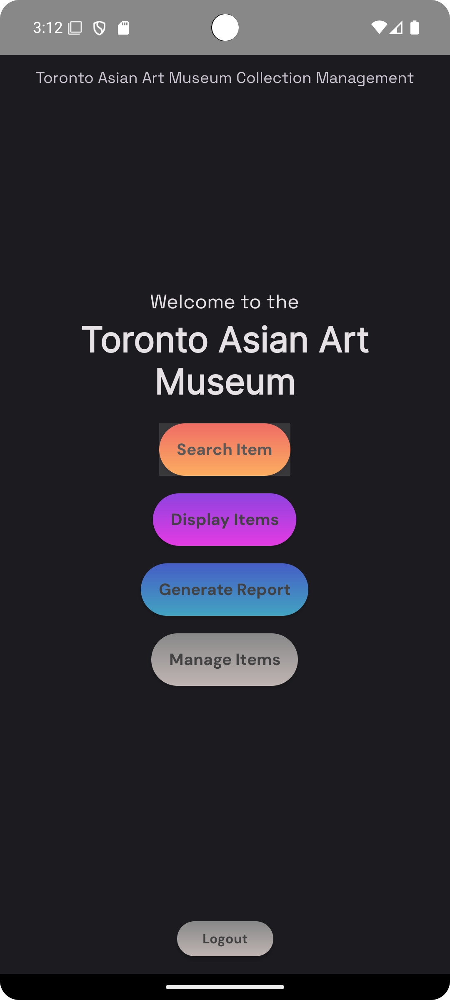
</div>

### Add Artifact

<div align="center">
  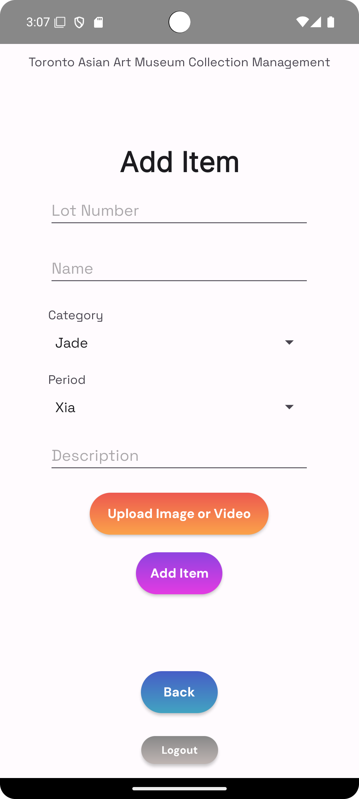 
  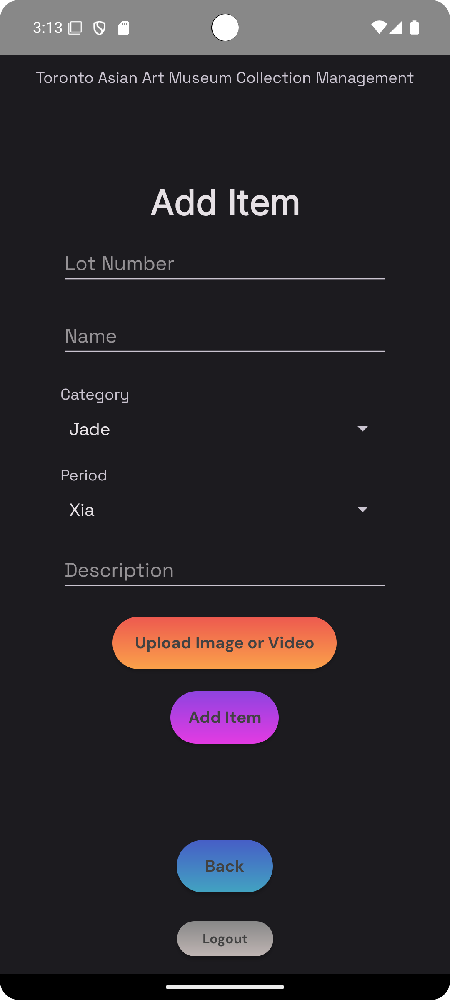
</div>

### View Artifact

<div align="center">
  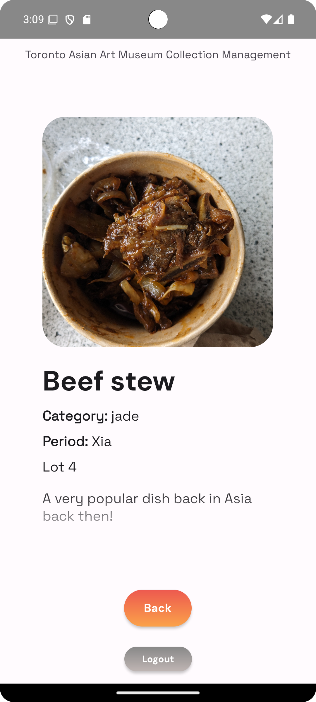 
  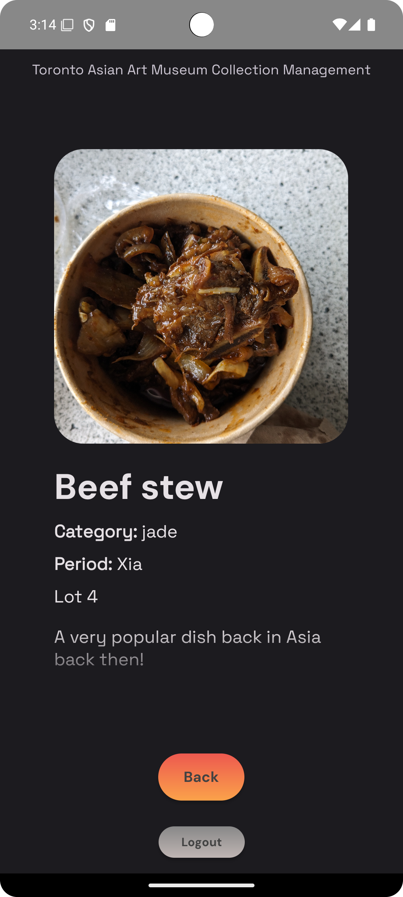
</div>

### Search Artifact

<div align="center">
  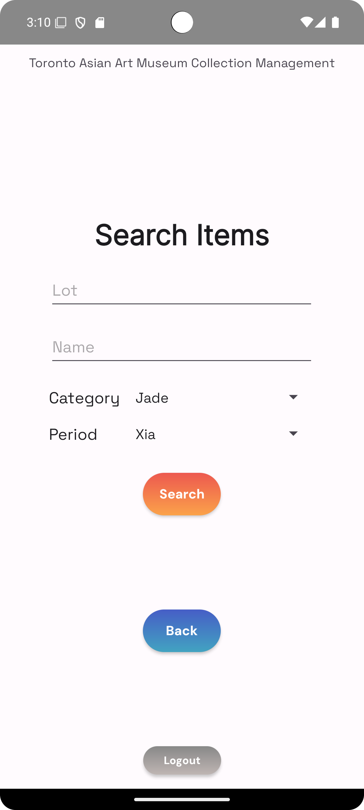 
  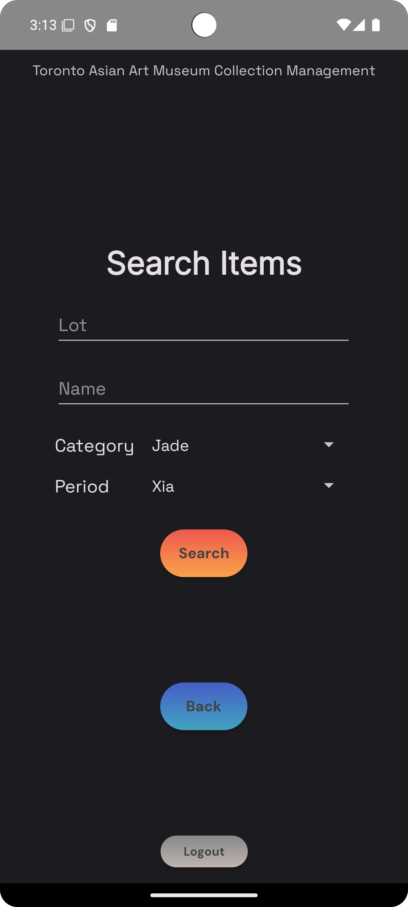
</div>

## Development Instructions

To get started with the development or to contribute to the project, follow these steps:

1. **Fork and/or Clone the Repository**:

    - Fork the repository to your GitHub account.
    - Clone the repository to your local machine using:
        ```bash
        git clone https://github.com/your-username/SoftwareDesignFinalProject.git
        ```

2. **Open the Project in Android Studio**:

    - Navigate to the project folder and open it in Android Studio.

3. **Run the Application**:
    - Once the project is loaded, hit the "Run" button in Android Studio to build and launch the app on an emulator or connected device.

### Code Structure

-   **Java Source Code**:  
    All the Java source code can be found in the directory:  
    `app/src/main/java/com/example/b07demosummer2024`

-   **XML Layouts**:  
    The XML layout files are located in:  
    `app/src/main/res/layout`
